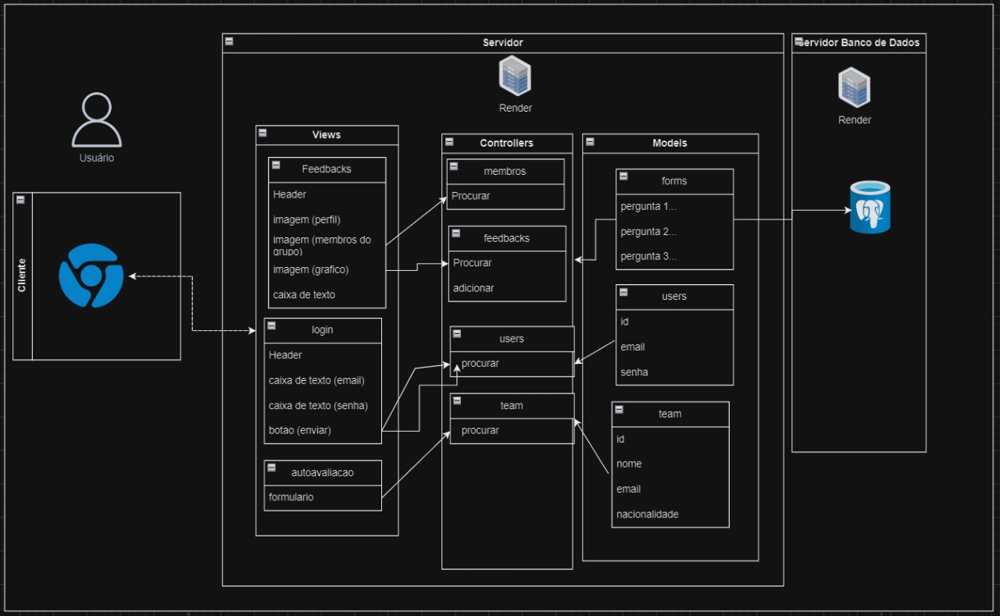
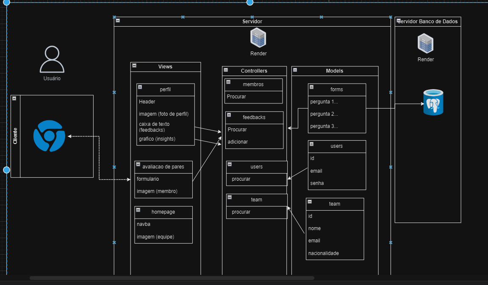

# Exemplo de Design de Arquitetura

mvc parte 1

mvc parte 2

Link de download Draw.io: (https://drive.google.com/file/d/13UPnI8o5HLwUt9bnBsUvmN2lxPxcZz-f/view?usp=sharing) 

# Template Readme para Arquitetura MVC em Markdown
- Nome do Projeto: Interculturalists
- Descrição: A ZUYD, em Maastricht, é especializada em Ciências Aplicadas, com aulas interativas e centradas em projetos para até 15 alunos, promovendo desenvolvimento profissional. Entretanto, a comunicação no jogo "Cesim Game" é ineficiente devido à falta de plataforma adequada, exacerbada pela diversidade cultural. Surge a necessidade de uma plataforma web para integrar os estudantes, promovendo colaboração e comunicação eficaz. Esta plataforma também permite feedbacks entre os usuários, visando melhorar a experiência educacional e prepará-los para desafios empresariais.
- Arquitetura: MVC (Model-View-Controller)
- Ferramenta de Diagramação: draw.io

### Modelos (Models):
forms: recebe a avaliação porposta e armazena um valor.

Users

id: Um código de identificação único atribuído a cada usuário, utilizado para facilitar pesquisas no banco de dados. Este modelo não será visível para o usuário, sendo utilizado apenas para organização interna.
email: Armazena o endereço de e-mail de cada usuário, necessário para fazer login na página. Durante o processo de cadastro, esta informação é inserida no banco de dados e posteriormente é utilizada apenas para verificar o login.
senha: Armazena a senha de cada usuário, necessária para confirmar o login na página. Durante o cadastro, esta informação é inserida no banco de dados e posteriormente é utilizada apenas para efetuar o login.

Teams

id: Um código de identificação exclusivo atribuído a cada membro do grupo, utilizado para facilitar pesquisas no banco de dados. Este modelo não será visível para o usuário, sendo utilizado apenas para organização interna.

E-mail: Armazena o endereço de e-mail do membro do grupo que está sendo visualizado, disponibilizado na tela de perfil para facilitar o contato direto entre esses membros, se necessário.

Nacionalidade: Registra o país de origem do membro do grupo que está sendo visualizado, disponibilizado em seu perfil para que seus colegas saibam sobre sua nacionalidade e, se desejarem, possam explorar mais sobre sua cultura.

### Controladores (Controllers):

Team

Procurar: quando o usuário seleciona um dos membros do grupo para visualizar, esse controller busca esse mebro no banco de dados para poder exibir o perfil na tela do usuário.

Feedbacks

Procurar: acionado quando o usuário clica para ver suas avaliações ou para avaliar seus pares, esse controller busca no banco de dados as avaliações recebidas pelo usuário ou então as avaliações que ele precisa responder.

Adicionar: acionado quando o usuário avalia algum de seus pares ou a si mesmo, esse controller é responsável por adicionar essa avaliação no banco de dados.

users
procurar: Verifica a existência do login e da senha no banco de dados. Os parâmetros são os dados inseridos nos campos de login e senha. Esse controlador é ativado quando o usuário clica no botão de envio na tela de login.

### Views (Views):

Página Inicial: Ao entrar no site, o usuário é direcionado para esta tela inicial. Aqui, são exibidas as fotos de todos os membros do grupo, permitindo que o usuário acesse os perfis individuais para informações mais detalhadas além das fotos de perfil.

Login: Esta tela é usada para verificar o acesso dos usuários ao site. Sendo assim, é uma interface relativamente simples, acessada sempre que o usuário deseja entrar no site. Seu propósito é garantir que apenas pessoas autorizadas tenham acesso ao conteúdo do site e que cada usuário visualize apenas as informações do seu próprio time.

Autoavaliação: Esta tela é acessada pelo usuário para responder sua própria avaliação. Aqui, são apresentados formulários com competências específicas, nas quais o usuário atribui uma nota a si mesmo. Em resumo, esta tela consiste em um formulário para avaliação do próprio desempenho no grupo.

Perfil: Ao visualizar o perfil de um membro do grupo, incluindo o próprio perfil, o usuário encontra esta tela. Aqui são exibidas informações como nome, nacionalidade, email e desempenho no grupo. O objetivo varia dependendo do acesso: ao visualizar o próprio perfil, o objetivo é permitir uma análise do desempenho, incluindo uma comparação entre a autoavaliação e a avaliação dos pares. Ao visualizar o perfil de um colega, o objetivo é fornecer informações detalhadas sobre o colega ou permitir um contato mais direto, como o endereço de email.

Avaliação dos Pares: O usuário acessa esta tela para responder à avaliação de seus colegas. Aqui, são apresentados formulários com competências específicas, nas quais o usuário atribui notas a seus colegas de equipe. Em resumo, esta tela é um formulário para avaliar o desempenho de cada colega de equipe.

### Infraestrutura:

- Descreva os componentes de infraestrutura do seu projeto, como bancos de dados, APIs externas e outras dependências.
- Explique como a infraestrutura se integra à arquitetura MVC.

### Justifique as escolhas feitas e como elas impactam o projeto.
#### Implicações da Arquitetura:
Descreva as implicações da arquitetura em termos de escalabilidade, manutenção, testabilidade e outros aspectos importantes.

### Recursos Adicionais:
- Documentação do Sails.js: https://github.com/balderdashy/sails
- Tutorial do draw.io: https://m.youtube.com/watch?v=w3zm-wbmlpc
- Exemplos de diagramas MVC: https://www.lucidchart.com/pages/templates

